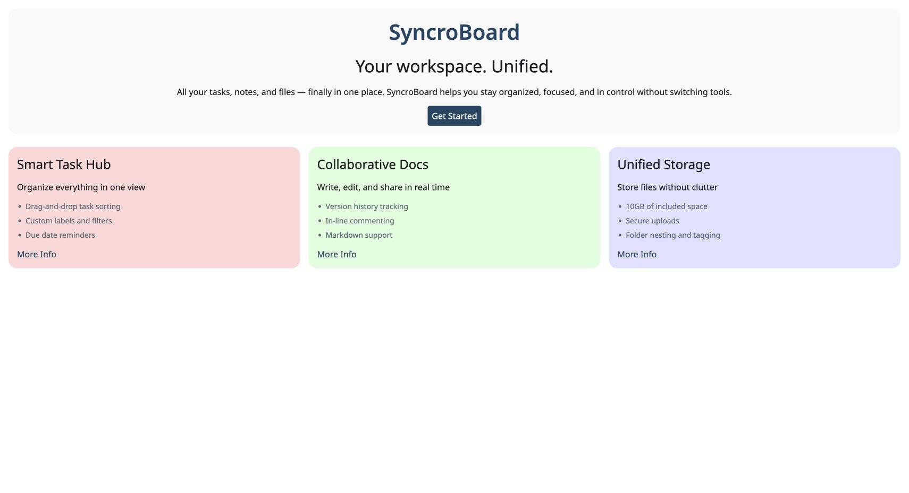

# Exercise 12 — Product Launch — SyncroBoard

[Live demo](https://vigneshsrinivasan-sys.github.io/exercise-12-product-launch-page/) · [HTML source](index.html) · [CSS source](styles.css)

## Why this exercise exists

This is an independent practice project completed while working through Colt Steele’s *The HTML & CSS Bootcamp*. The course provides the ordered learning content; I use each exercise to reinforce the concept until it is understood, then apply it in a concrete interface and push beyond the minimum lesson where appropriate. Together, these projects document a deliberate progression toward stronger design-to-code fluency as a Product Designer.

## Focus

**Primary practice:** Landing-page hierarchy, Grid, buttons, and interaction

## What I built

A product launch page combines a clear hierarchy, three feature components, grid layout, button styles, shadows, and multiple hover states.

## Implementation notes

- The page is a static HTML/CSS build with the original exercise content and visual treatment preserved for inspection.
- The preview above is a rendered snapshot of the project; the live demo shows the page itself.
- The source is presented as a standalone project so the exercise can be opened, understood, and reviewed without navigating through a larger catalogue.

## Sequence

**Exercise 12** · Independent practice
